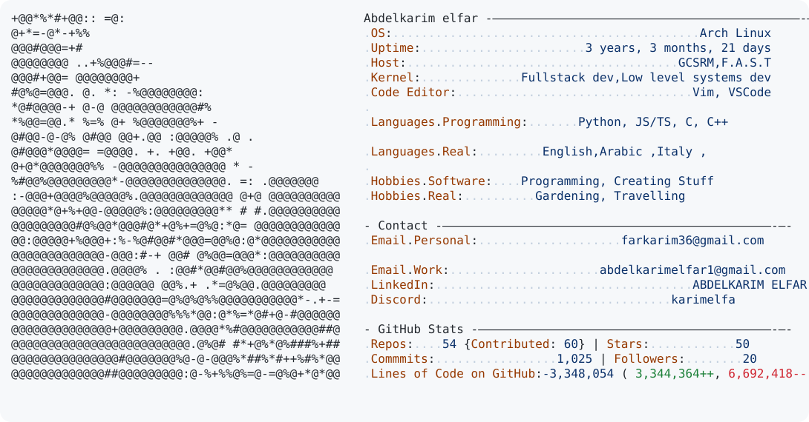

<a href="https://github.com/karimtz999/karimtz999">
  <picture>
    <source media="(prefers-color-scheme: dark)" srcset="./dark_mode.svg">
    
  </picture>
</a>

 

<h2>Ask me about Arch,C,C++,Embeded Systems</h2>

##

  <picture>
    <source media="(prefers-color-scheme: dark)" srcset="https://raw.githubusercontent.com/SnehalDas135/SnehalDas135/output/pacman-contribution-graph-dark.svg">
    <source media="(prefers-color-scheme: light)" srcset="https://raw.githubusercontent.com/SnehalDas135/SnehalDas135/output/pacman-contribution-graph.svg">
    
  </picture>

<!-- 📫 How to reach me **cyb.shibrajdas@gmail.com** -->

 

<table align="center">
  <tr>
    <td align="center">
      
    </td>
    <td align="center">
      
    </td>
  </tr>
</table>

<h3 align="left">Connect with me:</h3>

  
  
  
  
  
  

###
<!--
## `> ACTIVE BUILDS`

<table>
<tr>

<td width="25%" valign="top">

**⬡ &nbsp; MACROBOARD : V1**

A highly programmable, multi-layered custom hardware macro pad and controller built around the ESP32 architecture. This device features a full 3x3 key matrix, a mouse-emulating analog joystick, an absolute analog potentiometer dial, and dedicated mode-switching indicators.

</td>

<td width="25%" valign="top">

**⬡ &nbsp; S Y N T H F L O W**

SynthFlow is a high-performance, open-source music streaming ecosystem built to give the music back to the listener. Inspired by the "01" leek aesthetic, it offers a seamless, high-fidelity audio experience completely free from ad interruptions.

</td>
<td width="25%" valign="top">

⬡   H A C K T I M E

Hackathon control room for organizers and teams. Features live countdowns, room codes, and broadcast announcements.

</td>

<td width="25%" valign="top">

**⬡ &nbsp; REM:MARK 1**

The Rem Mark 1 solution redefines data privacy by moving away from traditional single-point protection. Instead of relying on a solitary security gate, it wraps information in multiple specialized layers of high-level protection.

</td>

</tr>
</table>
-->

## 💻 Tech Stack

### 🛠️ Programming Languages
 
 
 
 
 
 
 
 

 
 

### 🌐 Web Development

 
 
 
 
 
 

### ⚙️ Backend & Infrastructure
 
 
 
 
 
 
 
 

### 🗄️ Databases & ORM
 
 
 
 
 

### 📊 Data Science & AI
 
 
 

### 🎨 Design & 3D Modeling
 
 

### 🔧 Tools & Workflow

 
 
 
 
 
 
 
 

